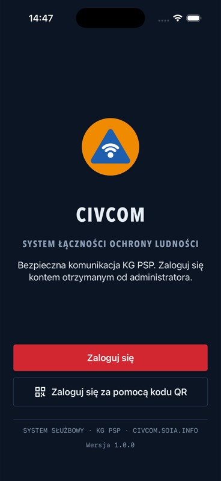
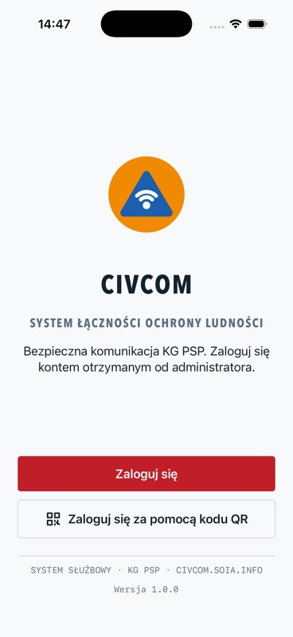

# CIVCOM — symulator po poprawce kolorów

Rzeczywisty ekran przed logowaniem, iPhone 17 Pro / iOS 26.5, 2026-10-05. Źródła aplikacji odpowiadały `8e667936c94171fe485e767faafd39b63f7de85b`; warstwa review zachowuje identyczne źródła. W jednym krótkim procesie zmieniono dark → light, bez nowego lokalnego raportu awarii. To dowód tego renderu, nie wszystkich ścieżek, logowania lub gotowości wydania.

Celowana regresja rozwiązała 33 role UIColor w obu motywach w `Task.detached`; jeden natywny test wykonany i zakończony PASS. Niezależny przegląd zaakceptował naprawę izolacji aktora. Surowe raporty awarii i prywatne dowody pozostają poza repozytorium.
